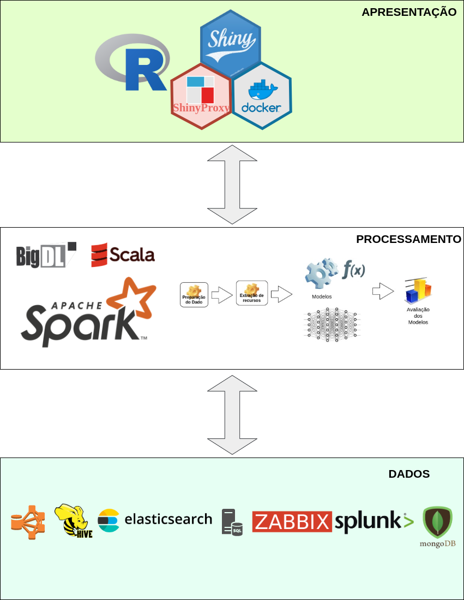

# PoC-BIGDL

### 1. INTRODUÇÃO
#### 1.1. OBJETIVO

Resolver problemas de segurança da informação com o uso de Deep 
Learning com a biblioteca BIGDL e linguagem Scala no topo do 
cluster Spark utilizando hardware comum.  

#### 1.2. JUSTIFICATIVA

O Apache Spark é um mecanismo de análise unificado para processamento de dados em larga escala. Alcança alto desempenho para processamento de dados em batch e stream. 
Scala é uma linguagem de programação multi-paradigma que oferece 
suporte à Programação Orientada a Objetos e Programação 
Funcional de forma conjunta que executa em um ambiente JVM. O Spark foi escrito em Scala, que é interoperável com java. O uso de Scala com o paradigma de programação funcional em conjunto com Apache Spark e o lazy evaluation facilitam e otimizam a  programação para sistemas distribuidos em cluster de  computadores. Scala disponibiliza bibliotecas de computação numérica <strong>ScalaNLP</strong>. 2020 Disponível em: 
   http://www.scalanlp.org/  
BIGDL é uma biblioteca distribuida de Deep Learning para o Apache Spark. Com BIGDL aplicações de Deep Learning podem ser escritas como programas padrão do Spark as quais podem rodar diretamente no topo de cluster Spark. BigDL usa Intel "Math Kernel Library" (MKL) e técnicas de computação paralela para alcançar um desempenho muito alto (comparável ao desempenho de GPU). 
<strong>Shinyproxy</strong> tem funcionalidade integrada para autenticação com autorização LDAP e usa spring ,uma tecnologia madura. Baseado na tecnologia docker matém os ambientes das apps isolados.

#### 1.3. MACRO ARQUITETURA

